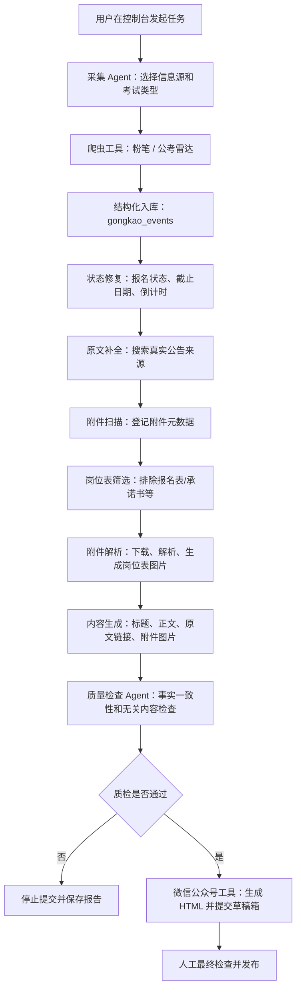

# 考公信息运营 Agent

一个面向微信公众号内容运营场景的自动化 Agent 项目。系统从公开考试招聘信息源采集公告，自动补全原文与附件，结构化入库，生成公众号文章，经大模型质量检查后提交到公众号草稿箱，最终由人工确认发布。

项目定位不是单纯爬虫，而是一个可观察、可干预、可批量执行的内容运营 Agent 工作流。

## 项目背景

考公、事业单位、教师、国企等招聘公告分散在多个网站，且信息更新快、格式不统一、附件多、截止时间敏感。人工运营公众号时，需要反复完成以下工作：

- 查找最新公告
- 判断公告是否还在报名期
- 找到原始公告链接
- 提取报名时间、招聘人数、地区、考试类型
- 下载岗位表附件
- 整理成微信公众号文章
- 避免大模型生成无关内容或改写事实
- 提交草稿箱后人工最终确认

本项目将这些步骤串成一套半自动化 Agent 流程，目标是提升信息收集、内容生产和发布准备效率。

## 当前能力

### 数据采集

- 支持从粉笔考试信息接口采集公告。
- 保留公考雷达采集作为备用来源。
- 支持按考试类型采集：公务员、事业单位、国企、教师、医疗、选调等。
- 支持一键补全“即将开始”和“正在报名”的全国公告。
- 自动写入 SQLite 信息库。

### 状态管理

- 自动归一化报名状态，只保留：
  - 即将开始
  - 正在报名
  - 报名结束
- 根据报名截止日期自动修正过期公告。
- 展示报名截止日期和倒计时。
- 对找不到原公告的记录做状态标记，避免重复搜索。

### 原文与附件处理

- 优先保留公告原文链接和原文 HTML。
- 支持扫描全库公告里的附件链接。
- 支持只登记附件元数据，不立即下载文件。
- 支持筛选岗位表、职位表、岗位计划、岗位需求表等候选附件。
- 自动排除报名表、申请表、承诺书、专业目录、操作说明等非岗位表附件。
- 支持下载并解析 `.xlsx`、`.xlsm`、`.docx` 等附件。
- 支持将岗位表转成图片，插入公众号文章。

### 内容生成

- 优先使用原公告正文和格式生成公众号内容。
- 如找到原公告，在文章开头提示“原文链接在文章最后”。
- 文章结尾附原文网址。
- 标题使用运营模板：
  - 地区 + 招聘人数 + 岗位亮点 + 报名截止
- 示例：
  - 洛阳招9人！科技馆科普辅导员，今日截止
  - 石家庄招52人！工商职业学院

### 大模型质量检查

- 使用 DeepSeek 模型进行草稿质检。
- 默认模型：`deepseek-v4-flash`
- 检查重点：
  - 是否出现与公告无关内容
  - 是否篡改招聘人数、时间、地区、岗位等事实
  - 是否保留原公告链接
  - 是否错误引用附件内容
- 质检报告保存到：
  - `F:\Automated_operation\kaoyan_collector\quality_reports`

### 微信公众号集成

- 支持生成 Markdown 和微信公众号 HTML。
- 支持上传封面图。
- 支持提交到微信公众号草稿箱。
- 支持批量提交草稿。
- 支持查看草稿箱列表和已发布列表。
- 直接发布接口已验证受公众号权限限制，当前账号返回：
  - `48001 api功能未授权`
- 因此当前生产流程采用“提交草稿箱 + 人工最终发布”的安全模式。

### 可视化控制台

本地 UI 支持：

- 快速采集入库
- 采集并搜索原公告
- 一键补全有效考试
- 公告库查看
- 按状态、分类、关键词筛选
- 批量生成公众号预览
- 批量提交草稿
- 批量扫描附件
- 批量下载岗位表
- 查看后台任务日志
- 查看 Agent 运行记录和工具调用轨迹
- 查看微信公众号草稿箱和已发布列表

启动命令：

```powershell
conda activate dome
cd /d F:\Automated_operation
python -B -m kaoyan_collector.ui_app --host 127.0.0.1 --port 7860
```

访问地址：

```text
http://127.0.0.1:7860
```

Agent 运行记录页面：

```text
http://127.0.0.1:7860/agent/runs
```

Agent 工具注册表页面：

```text
http://127.0.0.1:7860/agent/tools
```

## Agent 工作流



## 工具化设计

当前项目已经具备 Agent Tool 的雏形。后续可以进一步抽象成标准工具调用层。

| Tool | 当前实现 | 作用 |
| --- | --- | --- |
| `crawl_fenbi_tool` | `kaoyan_collector.fenbi_crawler` | 按考试类型和报名状态采集公告 |
| `crawl_gongkaoleida_tool` | `kaoyan_collector.gongkaoleida_crawler` | 备用采集源 |
| `event_store_tool` | `kaoyan_collector.store` / `schema` | 公告去重、结构化入库 |
| `attachment_scan_tool` | `kaoyan_collector.gongkao_attachments --metadata_only` | 扫描并登记附件链接 |
| `job_table_download_tool` | `kaoyan_collector.gongkao_attachments --job_tables_only` | 下载解析岗位表候选附件 |
| `attachment_image_tool` | `kaoyan_collector.attachment_images` | 将岗位表生成公众号可用图片 |
| `article_generate_tool` | `kaoyan_collector.gongkao_wechat_pipeline` | 生成公众号标题、正文、HTML |
| `quality_check_tool` | `gongkao_wechat_pipeline` 内质量检查逻辑 | 大模型审核草稿内容 |
| `wechat_draft_tool` | `wechat_article_skills/wechat-draft-publisher` | 提交微信公众号草稿 |
| `ui_task_tool` | `kaoyan_collector.ui_app` | 后台任务编排、日志、重试入口 |

工具注册表代码：

```text
F:\Automated_operation\kaoyan_collector\agent_tools.py
```

UI 页面会读取该注册表，展示每个工具的输入、输出、风险等级和是否需要人工确认。

## 数据库设计

默认数据库：

```text
F:\Automated_operation\kaoyan_collector\data\kaoyan_content.db
```

核心表：

| 表 | 说明 |
| --- | --- |
| `gongkao_events` | 公告主表，保存标题、地区、考试类型、报名时间、原文、状态等 |
| `gongkao_event_attachments` | 附件表，保存附件链接、下载状态、解析状态、本地路径、解析文本等 |
| `wechat_publish_records` | 微信公众号草稿和发布记录 |
| `content_items` | 早期多平台内容采集表，保留作为扩展能力 |
| `agent_runs` | Agent 运行主表，记录每次任务目标、状态、输入、输出和耗时 |
| `agent_steps` | Agent 工具调用步骤表，记录工具名称、参数、观察结果和错误 |

附件目录：

```text
F:\Automated_operation\kaoyan_collector\attachments
```

公众号输出目录：

```text
F:\Automated_operation\kaoyan_collector\wechat_outputs
```

## 关键工程问题与解决方案

### 1. 第三方聚合站信息不等于官方原文

问题：聚合站能快速获取标题和摘要，但不一定有完整信息，且可能缺少附件。

方案：

- 先从聚合站采集公告标题并入库。
- 再根据标题搜索真实原公告。
- 找到原公告后保存原文 URL、HTML 和正文。
- 生成内容时优先使用原公告。

### 2. 报名状态容易过期

问题：网站返回的状态可能是“正在报名”，但截止日期已经过去。

方案：

- 入库后根据当前日期二次修正状态。
- 页面查询前自动修复状态。
- UI 展示截止日期和倒计时，避免人工误判。

### 3. 附件类型混杂

问题：公告附件里既有岗位表，也有报名表、承诺书、专业目录、操作说明。

方案：

- 增加轻量扫描模式，只登记附件链接。
- 增加岗位表筛选规则。
- 排除非岗位表附件。
- 只把岗位表图片加入文章。

### 4. 大模型可能生成无关内容

问题：招聘公告属于事实敏感内容，不能凭空补充、夸张或混入无关信息。

方案：

- 生成后增加大模型质量检查。
- 检查失败则停止提交草稿。
- 保存质量报告便于复盘。

### 5. 公众号接口权限受限

问题：当前公众号支持草稿接口，但直接发布接口返回 `48001 api功能未授权`。

方案：

- 当前采用“自动提交草稿箱 + 人工最终确认发布”。
- 这比强行全自动发布更符合内容合规和事实核验要求。

## 当前运行成果

截至当前版本，本地库已具备：

- 公告总数：737 条
- 附件记录：1855 条
- 有附件记录的公告：714 个
- 岗位表候选：约 250 个
- 已打通公众号草稿箱提交流程
- 已打通岗位表图片插入公众号草稿流程
- 已增加 Agent Run / Step 轨迹记录，UI 任务会自动留下工具调用审计记录

## 面试讲法

可以这样介绍项目：

> 我做了一个考公信息运营 Agent。它不是只爬数据，而是把信息采集、状态判断、原文补全、附件解析、公众号内容生成、大模型质检和草稿提交串成了一个可视化工作流。  
>  
> 这个项目里我重点解决了三个 Agent 工程问题：第一，信息源不可靠，所以需要先采集聚合站，再补全原始官方公告；第二，内容生成有事实风险，所以我在提交前加了大模型质量检查；第三，自动发布有合规风险，所以我把最终动作设计成提交草稿箱，由人确认发布。  
>  
> 从工程实现上，我把爬虫、附件解析、内容生成、公众号提交都做成可被任务系统调用的工具，并在 UI 里提供批量任务、日志和失败重试入口。

## 可展示亮点

- 有真实业务闭环，不是 Demo 对话机器人。
- 有工具调用、任务编排、状态管理和人工确认。
- 有 LLM 质检，体现 Agent 可靠性设计。
- 有附件解析和图片生成，处理了非结构化文档。
- 有微信公众号真实 API 集成。
- 有可视化控制台，便于演示。
- 遇到公众号权限限制后，选择了合理的人机协同方案。

## 下一步升级方向

### 1. 标准 Agent 编排层

将当前脚本任务抽象成统一的 Agent Planner：

```text
Plan -> Tool Call -> Observation -> Decision -> Final Action
```

目标是让系统能根据公告状态自动决定：

- 是否需要搜索原文
- 是否需要扫描附件
- 是否需要下载岗位表
- 是否适合生成公众号草稿
- 是否需要人工审核

### 2. Agent 决策记录

已新增 `agent_runs` 和 `agent_steps` 表，开始记录 UI 任务：

- 输入
- 调用的工具
- 工具输出
- 最终结果

下一步可继续增加更细粒度的规划和决策原因：

- 为什么选择这个公告
- 为什么需要下载附件
- 为什么停止提交草稿
- 为什么需要人工审核

这会让项目更像可审计的 Agent 系统。

### 3. 自动评测集

构建一批公告样例，评估：

- 招聘人数提取准确率
- 截止日期准确率
- 原文链接保留率
- 附件岗位表识别准确率
- 生成内容事实一致性

### 4. 多源权威性排序

不同来源同一公告去重后，按权威性保留：

```text
官方人社/考试网 > 学校/单位官网 > 粉笔/公考雷达等聚合站
```

### 5. 内容运营反馈闭环

后续可接入公众号阅读数据，记录：

- 标题点击率
- 草稿通过率
- 发布后的阅读量
- 不同标题模板效果

然后让 Agent 根据反馈优化标题和选题策略。

## 常用命令

启动控制台：

```powershell
conda activate dome
cd /d F:\Automated_operation
python -B -m kaoyan_collector.ui_app --host 127.0.0.1 --port 7860
```

粉笔采集：

```powershell
python -m kaoyan_collector.fenbi_crawler --category 事业单位 --max_items 50 --page 1
```

一键补全有效考试：

```powershell
python -m kaoyan_collector.fenbi_crawler --backfill_active --max_items 50
```

扫描全库附件链接：

```powershell
python -m kaoyan_collector.gongkao_attachments --limit 5000 --max_attachments 0 --metadata_only
```

下载某公告岗位表附件：

```powershell
python -m kaoyan_collector.gongkao_attachments --topic_id 466787286406144 --max_attachments 5 --job_tables_only
```

生成公众号预览：

```powershell
python -m kaoyan_collector.gongkao_wechat_pipeline --topic_id 466787286406144 --skip_publish
```

提交公众号草稿：

```powershell
python -m kaoyan_collector.gongkao_wechat_pipeline --topic_id 466787286406144 --wechat_cover F:\Automated_operation\wechat_cover.png
```

带附件岗位表图片提交草稿：

```powershell
python -m kaoyan_collector.gongkao_wechat_pipeline --topic_id 466787286406144 --wechat_cover F:\Automated_operation\wechat_cover.png --include_attachment_images
```
